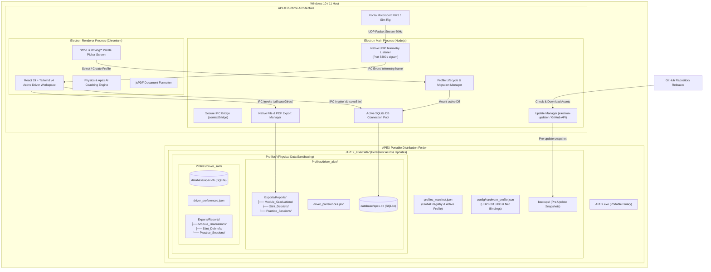
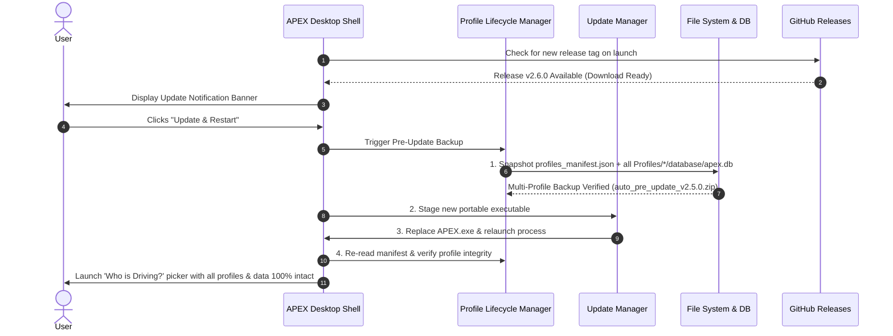

# APEX DEVELOPMENT ROADMAP: Portable Distribution, Multi-Profile Isolation & Local Data Architecture

> **Target Goal:** Deliver a high-performance, standalone portable Windows executable (`APEX.exe`) with multi-driver profile sandboxing, continuous GitHub Releases update pipeline, guaranteed zero data loss across updates, complete local data ownership, embedded SQLite telemetry engine, and structured per-driver PDF export management.

---

## 1. Executive Summary & Core Principles

| Principle | Architectural Decision | Implementation Specification |
| :--- | :--- | :--- |
| **Zero-Install Portability** | Single portable `.exe` runtime | Packaged with `electron-builder` (`portable` target) requiring zero prerequisites or system installation. |
| **Complete Multi-Profile Isolation** | Physical per-driver sandboxing | Each driver profile has its own isolated directory in `./APEX_UserData/Profiles/[ProfileSlug]/` containing its own `apex.db`, preferences, and `Exports/Reports/` subtree. |
| **"Who is Driving?" Gateway** | Visual cold-launch profile picker | Every cold launch displays a motorsport-themed driver selection screen with quick-switching available at runtime via the TopBar. |
| **Strict Data Ownership** | Zero cloud dependency, local-first | All driver progress, levels, stint sessions, and raw telemetry live exclusively on the user's local disk in `./APEX_UserData/`. |
| **Zero Data Loss Upgrades** | Isolated user data directory | Executable updates swap independently of the `./APEX_UserData/` folder, backed by automated pre-update database snapshots in `./APEX_UserData/backups/`. |
| **High-Performance Storage** | Embedded SQLite Engine | Replaces `localStorage` with `better-sqlite3` per profile to support high-resolution 60Hz telemetry, full stint archives, and instant query indexing without quota limits. |
| **Hierarchical PDF Archives** | Dedicated per-driver filesystem | Native PDF generation writes directly to categorized directories: `./APEX_UserData/Profiles/[ProfileSlug]/Exports/Reports/[Category]/[TrackName]/`. |
| **Automated Delivery Pipeline**| GitHub Releases + In-App Updater | Tagged Git releases trigger GitHub Actions to compile, test, sign/hash, and publish updates with in-app changelog notifications. |

---

## 2. System Architecture & Multi-Profile Topology



---

## 3. Directory Layout & Isolated Profile Hierarchy

When distributed, the portable executable maintains completely sandboxed per-driver directories:

```text
d:/SimRacing/APEX/                                 <-- User's chosen folder or USB drive
├── APEX.exe                                       <-- Portable Application Executable
└── APEX_UserData/                                 <-- NEVER touched or purged during updates
    ├── profiles_manifest.json                     <-- Global Registry (Profile List, Active ID, App Theme)
    ├── config/
    │   └── hardware_profile.json                  <-- Shared hardware settings (UDP port 5300, IP bind)
    ├── backups/
    │   ├── auto_pre_update_v2.5.0.bak.zip         <-- Full multi-profile snapshot prior to updates
    │   └── manual_backup_2026-08-20.zip
    └── Profiles/
        ├── driver_alex_turner/                    <-- Driver 1 Isolated Workspace
        │   ├── profile_meta.json                  <-- Name, Helmet Avatar, Created Date, Bio
        │   ├── driver_preferences.json            <-- Widget layouts, voice coach volume, delta colors
        │   ├── database/
        │   │   ├── apex.db                        <-- Alex's private SQLite database (progress, stints, laps)
        │   │   ├── apex.db-wal
        │   │   └── apex.db-shm
        │   └── Exports/
        │       └── Reports/
        │           ├── Module_Graduations/        <-- Alex's Skip Barber Graduation Diplomas
        │           │   └── Lime_Rock_Park/
        │           │       └── 2026-08-20_Mod01_Threshold_Braking_PASS.pdf
        │           ├── Stint_Debriefs/            <-- Alex's Multi-lap coaching reports
        │           │   └── Watkins_Glen_Grand_Prix/
        │           │       └── 2026-08-20_Stint04_FormulaSkipBarber_8Laps.pdf
        │           └── Practice_Sessions/         <-- Alex's Single-lap telemetry analysis cards
        │               └── Maple_Valley_Full/
        │                   └── 2026-08-20_Lap03_1m32s410ms.pdf
        │
        └── driver_sarah_connor/                   <-- Driver 2 Isolated Workspace
            ├── profile_meta.json
            ├── driver_preferences.json
            ├── database/
            │   └── apex.db                        <-- Sarah's private SQLite database
            └── Exports/
                └── Reports/
                    ├── Module_Graduations/
                    ├── Stint_Debriefs/
                    └── Practice_Sessions/
```

---

## 4. Phased Development Roadmap

### Phase 1: Desktop Shell Foundation & Native UDP Engine
*Deliverable: Native Electron container running React 19 + direct Node.js UDP socket handling without separate terminal servers.*

- [ ] **1.1 Electron Integration**
  - Install and configure `electron`, `electron-builder`, `vite-plugin-electron`, and `vite-plugin-electron-renderer`.
  - Configure `electron/main.ts` with strict security settings (`contextIsolation: true`, `nodeIntegration: false`, `sandbox: true` for renderer).
  - Implement `electron/preload.ts` exposing typed IPC channels via `contextBridge`.
- [ ] **1.2 Embedded Native UDP Telemetry Server**
  - Refactor `server/udpServer.js` into an internal Electron Main service (`electron/services/telemetryListener.ts`).
  - Eliminate the standalone `npm run udp-server` step; telemetry initializes automatically with the app lifecycle.
  - Implement high-frequency IPC batching (buffering 60Hz telemetry packets to 30Hz-60Hz UI dispatch to avoid main thread starvation).
- [ ] **1.3 Portable Directory Resolution**
  - Create directory resolver utility (`electron/utils/paths.ts`):
    - Determine execution root via `process.env.PORTABLE_EXECUTABLE_DIR || path.dirname(process.execPath)`.
    - Ensure `./APEX_UserData/` and default manifests are automatically initialized on cold launch.

---

### Phase 2: Multi-Profile Architecture & Embedded SQLite Engine
*Deliverable: Full physical profile isolation, "Who is Driving?" screen, and per-profile SQLite databases.*

- [ ] **2.1 Global Profile Manifest & Lifecycle Manager**
  - Create `electron/services/profileManager.ts`:
    - Manage `profiles_manifest.json` (List of profiles, active profile ID, last used timestamp).
    - Handle profile operations: `createProfile`, `switchProfile`, `deleteProfile`, `renameProfile`, `exportProfileZip`, `importProfileZip`.
    - Auto-create sandboxed folder structure for each new profile (`database/`, `Exports/Reports/`, `config/`).
- [ ] **2.2 "Who is Driving?" Gateway Screen & TopBar Switcher**
  - Design visual profile selection modal / startup screen displaying driver cards (Avatar/Helmet color, Name, Driver Level badge, Total Laps, Best Score).
  - Include `+ Create New Driver Profile` modal with instant validation.
  - Integrate a TopBar driver badge allowing instant profile hot-switching at runtime without restarting the application.
- [ ] **2.3 Per-Profile SQLite Database Schema (`better-sqlite3`)**
  - Dynamic database connection switching: When a driver profile is activated, the Electron main process mounts that driver's specific `./APEX_UserData/Profiles/[slug]/database/apex.db`.
  - Schema tables: `user_progress`, `stints`, `laps`, `corners`, `lap_telemetry_frames`.
- [ ] **2.4 Legacy Data Auto-Migration into Default Profile**
  - On initial upgrade from browser `localStorage`, create a `Default Driver` profile and import legacy progress and stints seamlessly.

---

### Phase 3: Native Per-Profile PDF Export Pipeline & File Management
*Deliverable: 1-click native PDF generation saved directly to the active driver's dedicated export folders.*

- [ ] **3.1 Sandboxed Filesystem PDF Saver**
  - Extend `src/utils/pdfGenerator.ts` to output direct ArrayBuffers to IPC.
  - IPC handler automatically resolves target path: `./APEX_UserData/Profiles/[ActiveProfile]/Exports/Reports/[Category]/[TrackName]/[FormattedFileName].pdf`.
  - Ensure parent directories are created on demand with sanitized track and session names.
- [ ] **3.2 In-App File Explorer & PDF Preview Hooks**
  - Add native "Open My Reports Folder" and "Show PDF in File Explorer" actions in UI using `electron.shell.showItemInFolder(filePath)`.
  - In-app toast notification upon PDF generation with a direct "Open PDF" button invoking the default OS PDF reader (`shell.openPath`).
- [ ] **3.3 Profile Export / Backup Tool**
  - Add 1-click "Export Driver Profile (.apexprofile)" producing a compressed archive of that driver's DB + PDF reports for easy transfer between sim rigs.

---

### Phase 4: GitHub Releases CI/CD & Zero-Data-Loss Auto-Updater
*Deliverable: Continuous build pipeline compiling portable `.exe` releases with safe in-place updater and multi-profile snapshot protection.*

- [ ] **4.1 GitHub Actions Build Workflow**
  - Create `.github/workflows/build-release.yml` triggering on version tag push (`v*.*.*`).
  - Automate steps: Checkout -> Node.js Setup -> Dependency Cache -> Vite Build -> Electron Builder Packaging -> Release Asset Upload.
  - Generate checksums (`SHA256SUMS.txt`) and changelog notes automatically.
- [ ] **4.2 Multi-Profile Pre-Update Safety Guard**
  - Configure `electron-updater` targeting GitHub Releases (`owner: mindcoder9033`, `repo: APEX-v2.5`).
  - **Pre-Update Safety Protocol**:
    1. Update detected & downloaded in background.
    2. Before triggering restart/install, create an atomic multi-profile backup: `APEX_UserData/backups/auto_pre_update_[current_version].zip` (backing up `profiles_manifest.json` and all profile `apex.db` files).
    3. Verify backup checksums before initiating binary swap.
    4. Replace executable in-place without touching `./APEX_UserData/`.
- [ ] **4.3 In-App Update Notification UI**
  - Non-intrusive banner in APEX TopBar: "New Version Available (vX.X.X) - [View Release Notes] [Restart & Update]".
  - Offline mode support: If no internet connection is detected, skip update checks silently with zero friction.

---

### Phase 5: Hardening, Performance Profiling & Packaging
*Deliverable: Sub-millisecond telemetry response, instant UI rendering, crash resilience, and clean distribution.*

- [ ] **5.1 Performance Optimization**
  - Ensure 60Hz telemetry ingestion uses zero-copy ArrayBuffers between UDP socket and the active profile's SQLite WAL.
  - Profile memory usage during rapid profile switching to guarantee zero SQLite connection leaks.
- [ ] **5.2 Offline & Antivirus Hardening**
  - Configure `electron-builder` metadata (App ID, Description, Publisher, Icon, DPI Awareness).
  - Verify Windows SmartScreen behavior and provide SHA-256 validation instructions in `README.md`.
- [ ] **5.3 End-to-End Verification Checklist**
  - Clean test on a fresh Windows 10/11 machine with no Node.js/Git installed.
  - Verify Driver Profile A -> Drive Stint -> Generate PDF -> Switch to Driver Profile B -> Verify Profile B has clean isolated progress -> Apply simulated update -> Verify both profiles 100% intact.

---

## 5. Technical Specifications & Interface Contracts

### 5.1 Profile Manifest Schema (`profiles_manifest.json`)

```json
{
  "version": "2.5.0",
  "activeProfileId": "prof_alex_turner_8831",
  "profiles": [
    {
      "id": "prof_alex_turner_8831",
      "slug": "driver_alex_turner",
      "displayName": "Alex Turner",
      "avatarColor": "#E10600",
      "helmetStyle": "apex-carbon",
      "driverLevel": "Beginner",
      "createdAt": "2026-08-20T10:00:00.000Z",
      "lastActiveAt": "2026-08-20T11:30:00.000Z",
      "totalLaps": 42
    },
    {
      "id": "prof_sarah_connor_9412",
      "slug": "driver_sarah_connor",
      "displayName": "Sarah Connor",
      "avatarColor": "#0077BE",
      "helmetStyle": "speed-stripes",
      "driverLevel": "Novice",
      "createdAt": "2026-08-19T14:15:00.000Z",
      "lastActiveAt": "2026-08-20T09:45:00.000Z",
      "totalLaps": 118
    }
  ],
  "globalSettings": {
    "telemetryUdpPort": 5300,
    "checkUpdatesOnStartup": true,
    "theme": "dark"
  }
}
```

---

### 5.2 SQLite Schema Definition (`./Profiles/[slug]/database/apex.db`)

```sql
-- Core User Progress & Progression State (Per-Driver)
CREATE TABLE IF NOT EXISTS user_progress (
    id INTEGER PRIMARY KEY CHECK (id = 1),
    selected_driver_level TEXT NOT NULL,
    unlocked_driver_levels TEXT NOT NULL, -- JSON Array
    unlocked_module_ids TEXT NOT NULL,    -- JSON Array
    unlocked_session_ids TEXT NOT NULL,   -- JSON Array
    completed_session_ids TEXT NOT NULL,  -- JSON Array
    graduated_module_ids TEXT NOT NULL,   -- JSON Array
    session_best_scores TEXT NOT NULL,    -- JSON Object
    challenge_results TEXT NOT NULL,      -- JSON Object
    graduation_results TEXT NOT NULL,     -- JSON Object
    total_laps_driven INTEGER DEFAULT 0,
    total_time_minutes REAL DEFAULT 0,
    updated_at DATETIME DEFAULT CURRENT_TIMESTAMP
);

-- Stint Summaries
CREATE TABLE IF NOT EXISTS stints (
    stint_id TEXT PRIMARY KEY,
    stint_number INTEGER NOT NULL,
    title TEXT NOT NULL,
    car_name TEXT NOT NULL,
    track_name TEXT NOT NULL,
    source TEXT NOT NULL,
    recorded_at DATETIME NOT NULL,
    duration_sec REAL NOT NULL,
    total_laps INTEGER NOT NULL,
    best_lap_time_sec REAL NOT NULL,
    avg_score REAL NOT NULL,
    module_number INTEGER,
    module_title TEXT,
    session_id TEXT,
    session_title TEXT
);

-- Individual Lap Telemetry & Skip Barber Pillar Scores
CREATE TABLE IF NOT EXISTS laps (
    lap_id TEXT PRIMARY KEY,
    stint_id TEXT NOT NULL,
    lap_number INTEGER NOT NULL,
    lap_time_sec REAL NOT NULL,
    valid INTEGER NOT NULL,
    overall_score REAL NOT NULL,
    recorded_at DATETIME NOT NULL,
    track_name TEXT NOT NULL,
    car_name TEXT NOT NULL,
    score_line REAL,
    score_braking REAL,
    score_throttle REAL,
    score_consistency REAL,
    ai_debrief_summary TEXT,
    FOREIGN KEY(stint_id) REFERENCES stints(stint_id) ON DELETE CASCADE
);

-- High-Frequency Telemetry Frames (Stored as Compressed Binary Blob)
CREATE TABLE IF NOT EXISTS lap_telemetry_frames (
    lap_id TEXT PRIMARY KEY,
    frame_count INTEGER NOT NULL,
    compressed_frames BLOB NOT NULL,
    created_at DATETIME DEFAULT CURRENT_TIMESTAMP,
    FOREIGN KEY(lap_id) REFERENCES laps(lap_id) ON DELETE CASCADE
);

CREATE INDEX IF NOT EXISTS idx_stints_track ON stints(track_name);
CREATE INDEX IF NOT EXISTS idx_laps_stint ON laps(stint_id);
```

---

### 5.3 Expanded Multi-Profile IPC Bridge API Contract (`electron/preload.ts`)

```typescript
export interface DriverProfileSummary {
  id: string;
  slug: string;
  displayName: string;
  avatarColor: string;
  helmetStyle: string;
  driverLevel: 'Beginner' | 'Novice' | 'Intermediate' | 'Advanced';
  createdAt: string;
  lastActiveAt: string;
  totalLaps: number;
}

export interface IpcApexApi {
  // Multi-Profile Management
  profiles: {
    getManifest: () => Promise<{ profiles: DriverProfileSummary[]; activeProfileId: string }>;
    createProfile: (profile: { displayName: string; avatarColor: string; helmetStyle: string; initialLevel: string }) => Promise<DriverProfileSummary>;
    switchProfile: (profileId: string) => Promise<{ success: boolean; activeProfile: DriverProfileSummary }>;
    updateProfile: (profileId: string, updates: Partial<DriverProfileSummary>) => Promise<DriverProfileSummary>;
    deleteProfile: (profileId: string) => Promise<{ success: boolean }>;
    exportProfile: (profileId: string) => Promise<{ success: boolean; filePath: string }>;
    importProfile: (archivePath: string) => Promise<DriverProfileSummary>;
  };

  // Telemetry Listener Controls
  telemetry: {
    startListening: (port?: number) => Promise<{ success: boolean; port: number }>;
    stopListening: () => Promise<{ success: boolean }>;
    onFrame: (callback: (frame: any) => void) => () => void;
    onStatusChange: (callback: (status: { connected: boolean; packetCount: number }) => void) => () => void;
  };

  // Active Profile Database Access
  db: {
    loadProgress: () => Promise<UserProgressState>;
    saveProgress: (progress: UserProgressState) => Promise<void>;
    loadStints: () => Promise<StintSession[]>;
    saveStint: (stint: StintSession) => Promise<void>;
    loadLapDetail: (lapId: string) => Promise<LapAnalysis | null>;
    createBackup: (label?: string) => Promise<{ success: boolean; path: string }>;
  };

  // Active Profile File System & PDF Management
  fs: {
    savePdfReport: (params: {
      category: 'Graduation' | 'Stint' | 'Practice';
      trackName: string;
      fileName: string;
      buffer: ArrayBuffer;
    }) => Promise<{ success: boolean; filePath: string }>;
    openInExplorer: (filePath: string) => Promise<void>;
    openFile: (filePath: string) => Promise<void>;
    getActiveProfilePath: () => Promise<string>;
  };

  // GitHub Auto-Updater
  updater: {
    checkForUpdates: () => Promise<void>;
    onUpdateAvailable: (callback: (info: { version: string; releaseNotes: string }) => void) => () => void;
    onUpdateDownloaded: (callback: (info: { version: string }) => void) => () => void;
    restartAndInstall: () => Promise<void>;
  };
}
```

---

## 6. Zero-Data-Loss & Disaster Recovery Guardrails



### Multi-Profile Safety Guarantees:
1. **Physical Directory Isolation:** Each driver's data is quarantined in `./APEX_UserData/Profiles/[slug]/`. Corrupting or deleting one profile cannot compromise another driver's stints or diplomas.
2. **Atomic Profile Backups:** Upgrades generate a unified multi-profile `.zip` snapshot in `./APEX_UserData/backups/`.
3. **True USB Portability:** Drivers can copy their dedicated `Profiles/driver_name/` directory onto a flash drive and paste it into any APEX installation seamlessly.

---

## 7. Immediate Next Steps for Implementation

1. **Step 1:** Scaffold Electron shell (`electron/main.ts`, `electron/preload.ts`, `electron/services/telemetry.ts`).
2. **Step 2:** Implement Profile Lifecycle Manager (`electron/services/profileManager.ts` & `profiles_manifest.json`).
3. **Step 3:** Build "Who is Driving?" Gateway UI and runtime TopBar profile switcher in React.
4. **Step 4:** Implement dynamic per-profile SQLite connection routing (`better-sqlite3`).
5. **Step 5:** Wire per-profile sandboxed PDF export routing in `src/utils/pdfGenerator.ts`.
6. **Step 6:** Configure GitHub Actions CI/CD (`.github/workflows/release.yml`) for automated portable `.exe` distribution.
