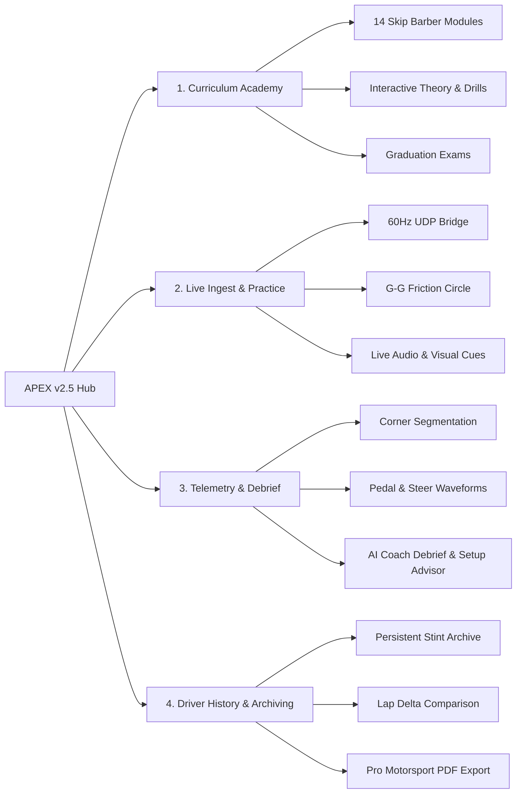

# APEX Brand Guidelines & Design Identity 🏎️
**Version:** 2.5  
**Platform:** Analytical & Curriculum-Driven Simracing Coach & Live Telemetry Suite  
**Core Reference:** Skip Barber’s *"Going Faster!"* (by Carl Lopez) & 60Hz Motorsport Telemetry  

---

## 1. Brand Essence & Mission

### 1.1 Brand Overview
**APEX** is a high-precision simracing engineering and driver-development platform. It bridges the gap between raw vehicle physics and accessible driver coaching by marrying real-time **60Hz UDP telemetry ingest** (Forza Motorsport / Forza Horizon) with the proven theoretical foundation of the **Skip Barber Racing School**.

### 1.2 Mission Statement
> *"To demystify vehicle dynamics and empower simracers of all skill levels to master the art of speed through real-time telemetry, structured curriculum, and empathetic race engineering."*

### 1.3 Core Brand Values & Pillars
1. **Uncompromised Precision:** 60Hz packet fidelity, true vector traction budgets ($G_{\text{total}} = \sqrt{G_{\text{lat}}^2 + G_{\text{lon}}^2}$), and sub-millisecond sector delta timing.
2. **Empathetic Coaching:** Bridging complex engineering data into human, digestible, and immediately actionable advice.
3. **Structured Progression:** Systematic 14-module curriculum with verifiable telemetry challenges and graduation benchmarks.
4. **Tactical Pitwall Aesthetic:** An immersive, high-contrast, dark-mode cockpit interface inspired by Formula 1 telemetry telemetry desks and Le Mans pit boxes.

---

## 2. Brand Voice, Tone & Persona

### 2.1 The "Friendly Race Engineer" Persona
APEX speaks as a world-class race engineer sitting on your pitwall who is also your biggest supporter. The voice is **knowledgeable, concise, encouraging, and clear**—never condescending, pedantic, or dry.

### 2.2 Voice Attributes
* **Authoritative yet Approachable:** Grounded in physics (slip angles, tire load, polar inertia), but explained through intuitive real-world driving analogies.
* **Positive & Growth-Oriented:** Mistakes are diagnosed as telemetry variances to optimize, not driver failures.
* **Concise & Direct:** Drivers make decisions in milliseconds. Communication is punchy, high-signal, and prioritized.

### 2.3 The "Three-Bite" Communication Rule
All automated feedback and coaching tips adhere to the three-bite structure:
1. **Bite 1 (What happened):** *"At Turn 1, you braked at the 200m board."*
2. **Bite 2 (Why it matters):** *"That is earlier than necessary, scrubbing momentum before corner entry."*
3. **Bite 3 (How to fix it):** *"Try braking at the 150m marker next lap for a higher minimum corner entry speed."*

### 2.4 Voice & Tone Do's vs. Don'ts

| Principle | ✅ Do (APEX Voice) | ❌ Don't (Avoid) |
| :--- | :--- | :--- |
| **Perspective** | *"You"*, *"Your car"*, *"Your tires"* | *"The driver"*, *"The subject"*, *"The vehicle"* |
| **Simplicity** | *"You turned in too early, pushing wide on corner exit."* | *"Suboptimal slip angle causing severe apex clipping variance."* |
| **Actionability** | Give 1–2 specific, high-priority fixes per stint. | Dump a 15-point list of every minor driving flaw. |
| **Encouragement** | *"Great job getting on throttle early at T5—you gained 0.3s!"* | *"Lap time still off pace."* |
| **Setup Advice** | *"Car is sliding on exit; soften the rear anti-roll bar by 1 click."* | *"Inadequate rear roll stiffness coefficient."* |

---

## 3. Brand Identity & Logo System

### 3.1 The APEX Monogram & Logo Mark
* **The Monogram ("A"):** A bold, sharp, geometric letter "A" set within a 45° chamfered badge (`chamfer-btn-sm`), backed by a crimson-to-burgundy linear gradient (`#E10600` to `#880400`) and bordered by an illuminated red highlight.
* **Wordmark:** `APEX` set in **Michroma** (bold, all-caps, tracking `0.08em` to `0.1em`), paired with an ultra-compact version badge `v2.5` (`font-mono`, `#FF4D4D`).
* **Sub-branding:** *"Analytical Simracing Coach"* set in **Inter** or **Barlow** (`#8E8E9F`).

```
┌─────────┐
│  / \    │  APEX [v2.5]
│ /───\   │  ANALYTICAL SIMRACING COACH
│/     \  │
└─────────┘
```

### 3.2 Visual Metaphors & Iconography
* **Diamond Micro-Pips (`diamond-pip`):** 45° rotated squares ($4\times4\text{px}$ to $8\times8\text{px}$) used as live telemetry status beacons, radio link indicators, and data stream heartbeats.
* **Corner HUD Brackets (`hud-bracket`):** Precision tactical crosshairs and corner brackets flanking telemetry cards and video feeds.
* **Chamfered 45° Geometry:** Signature angular cuts on primary action buttons, tabs, and category badges, reinforcing aerodynamic carbon-fiber construction.

---

## 4. Color Architecture & Design Tokens

### 4.1 F1 Chassis & Pitwall Neutrals (Dark Mode Foundation)
APEX is exclusively dark-mode engineered for optimal contrast in low-light simulator rigs.

| Token Name | Hex Code | Purpose / Usage |
| :--- | :--- | :--- |
| `carbon-bg` / `body` | `#0A0A0E` | Deep obsidian backdrop; zero glare for night simulator sessions. |
| `f1-carbon` | `#0D0D11` | Primary container and outer viewport background. |
| `hud-panel` | `#0D0D14` | Tactical HUD dashboard and telemetry visualizer panels. |
| `f1-card` | `#14141B` | Secondary cards, navigation bars, and modular tiles. |
| `f1-cardHover` | `#1B1B24` | Interactive hover states, elevated lists, and active rows. |
| `f1-border` | `#232330` | Structural hairpins, grid dividers, and modular panel borders. |
| `f1-textMuted` | `#8E8E9F` | Secondary labels, units ($\text{km/h}$, $\text{G}$, $\text{ms}$), and subtitles. |
| `text-primary` | `#F3F4F6` | High-readability pure white/slate primary typography. |

### 4.2 Brand Racing Accents (Motorsport Red)

| Token Name | Hex Code | Purpose / Usage |
| :--- | :--- | :--- |
| `f1-red` (Primary) | `#E10600` | Signature motorsport red. Active tabs, primary CTAs, threshold limit. |
| `f1-darkred` | `#9B0400` | Gradient lowlights, border depths, and dark badge fills. |
| `f1-lightred` | `#FF3B30` | Warning alerts, live recording badges, and critical apex flags. |
| `f1-red-glow` | `rgba(225, 6, 0, 0.35)` | Neon pitwall glow effects on active controls. |

### 4.3 High-Precision Telemetry Spectrum
Dedicated, unambiguous colors assigned to specific vehicle telemetry data channels:

| Channel / Metric | Hex Code | Visual Character |
| :--- | :--- | :--- |
| **Speed / Velocity** | `#00F0FF` | Electric Cyan (HUD speedometers, radar vectors, clock icons) |
| **Throttle Input** | `#00FF66` | Apex Neon Green (Pedal traces, acceleration, positive delta) |
| **Brake Input** | `#FF1801` | Deceleration Crimson (Threshold pressure, trail-brake traces) |
| **Steering Angle** | `#FFAA00` | High-Visibility Amber (Yaw angles, steering wheel traces) |
| **Lateral G-Force** | `#D946EF` | Vector Magenta (Cornering load, lateral friction vector) |
| **Longitudinal G-Force** | `#3B82F6` | Dynamic Cobalt (Braking G, acceleration squatted load) |
| **Tire Slip / Friction Limit** | `#F59E0B` | Warning Amber (Slip angle exceeded, traction budget warning) |
| **Positive Delta (Faster)** | `#10B981` | Sector Purple / Emerald Green (Time gained vs. reference lap) |
| **Negative Delta (Slower)** | `#EF4444` | Sector Red (Time lost vs. reference lap) |

---

## 5. Typography System

The APEX typography hierarchy serves distinct roles across aesthetic branding, tactical telemetry readouts, and structured learning:

```
┌────────────────────────────────────────────────────────────────────────┐
│  DISPLAY & BRANDING:  Michroma / Eurostile                             │
│  "APEX v2.5 RACING ACADEMY"                                            │
├────────────────────────────────────────────────────────────────────────┤
│  HUD & METRICS:       Orbitron / Rajdhani                              │
│  "248 KM/H  •  1.85 G  •  GEAR 5"                                      │
├────────────────────────────────────────────────────────────────────────┤
│  TECH & TABLES:       Barlow Condensed / DIN 1451                      │
│  "TURN 3 • LATE APEX • EXIT DELTA -0.142s"                             │
├────────────────────────────────────────────────────────────────────────┤
│  BODY & CURRICULUM:   Inter / Barlow                                   │
│  "Progressively bleed off the brake pressure as you approach the clip."│
├────────────────────────────────────────────────────────────────────────┤
│  DATA & DELTAS:       JetBrains Mono [tabular-nums]                    │
│  "1:42.384  (+00.128)  [60Hz UDP STREAM ACTIVE]"                       │
└────────────────────────────────────────────────────────────────────────┘
```

### 5.1 Font Family Directory

| Category | Primary Font | Fallbacks | Usage & Rules |
| :--- | :--- | :--- | :--- |
| **Display / Racing** | `Michroma` | `Eurostile`, `Microgramma`, `sans-serif` | App logo, module titles, hero banners, trophy badges. |
| **HUD / Cockpit** | `Orbitron` / `Rajdhani` | `sans-serif` | Live speedometers, gear indicators, telemetry gauges. |
| **Technical / Densified** | `Barlow Condensed` | `DIN 1451`, `FF DIN`, `sans-serif` | Telemetry tables, corner cards, setup tuning parameters. |
| **Body & Curriculum** | `Inter` / `Barlow` | `system-ui`, `sans-serif` | Long-form curriculum text, debrief advice, modal dialogs. |
| **Monospace / Timing** | `JetBrains Mono` | `Roboto Mono`, `monospace` | Lap times, sector splits, packet telemetry, IP addresses. |

### 5.2 Numeric Stability Rule
All real-time telemetry numbers, clocks, and lap times **MUST** enforce `font-variant-numeric: tabular-nums` (`font-feature-settings: 'tnum', 'zero'`). Numbers must never shift or jitter horizontally during live 60Hz playback.

---

## 6. UI Components & Geometry Specs

### 6.1 45° Chamfered Geometry Tokens
* `.chamfer-btn`: Cut corner geometry (`clip-path: polygon(8px 0%, 100% 0%, 100% calc(100% - 8px), calc(100% - 8px) 100%, 0% 100%, 0% 8px)`).
* `.chamfer-tab`: Angled tab header (`clip-path: polygon(6px 0%, 100% 0%, 100% 100%, 0% 100%, 0% 6px)`).
* `.chamfer-badge`: Micro pill badges (`clip-path: polygon(4px 0%, 100% ...)`).

### 6.2 Tactical Corner Crosshairs & Brackets
```css
/* Standard Motorsport HUD Corner Brackets */
.hud-bracket::before {
  top: -1px; left: -1px; width: 6px; height: 6px;
  border-top: 2px solid #E10600;
  border-left: 2px solid #E10600;
}
.hud-bracket::after {
  bottom: -1px; right: -1px; width: 6px; height: 6px;
  border-bottom: 2px solid #E10600;
  border-right: 2px solid #E10600;
}
```

### 6.3 Scrollbars
Custom sharp-edge zero-radius telemetry scrollbars (`6px` width, background `#0D0D14`, thumb `#252535`, thumb hover `#E10600`).

---

## 7. Product Architecture & Navigation Structure

APEX is organized into four core operational environments:



1. **Curriculum Academy (`curriculum`):** The 14-module Skip Barber structured learning track with theory, interactive SVG drill diagrams, and graduation exams.
2. **Live Ingest & Practice (`practice`):** Real-time cockpit dashboard with 60Hz UDP reception, live G-G friction circle, 4-corner suspension load, and multi-lap stint recording.
3. **Telemetry & Debrief (`debrief`):** High-density waveform telemetry studio, automatic corner-by-corner analysis (Entry, Apex, Exit), handling diagnostics, and AI Coach debrief.
4. **Driver History (`history`):** Complete session log, car/track filters, lap time trends, and one-click Pro Engineering PDF debrief export.

---

## 8. Brand Terminology & Glossary

| Term | Brand Standard Definition |
| :--- | :--- |
| **Traction Budget** | Total vector grip available across lateral and longitudinal friction limits ($100\% = \text{peak grip}$). |
| **Trail Braking** | The progressive, controlled release of brake pressure while simultaneously increasing steering angle into the apex. |
| **Late Apex** | A clipping point positioned past the geometric center of a turn, prioritizing early throttle commitment and straightaway exit speed. |
| **Slip Angle** | The angular difference between the direction the tire is pointed and the actual direction the vehicle is traveling. |
| **Type 1 Corner** | Corners preceding a significant straightaway; exit speed is prioritized above all else. |
| **Type 2 Corner** | Corners at the end of a long straight; entry speed and braking performance are prioritized. |
| **Type 3 Corner** | Corners leading immediately into another corner (chicanes/S-bends); exit speed from the *last* turn governs the complex. |
| **UDP Ingest** | High-frequency binary network stream (60 packets/sec) broadcasting telemetry directly from Forza over port `5300`. |

---

## 9. Brand Compliance & Design Checklist

Before releasing any new feature, visual component, or PDF report in APEX, verify:

- [x] **Dark-Mode Integrity:** Is the background strictly using carbon neutrals (`#0A0A0E` / `#0D0D14` / `#14141B`)?
- [x] **Zero Fluff:** Are cards and panels sharp, functional, and devoid of unnecessary roundings or decorative padding?
- [x] **Telemetry Color Integrity:** Does Speed use Cyan (`#00F0FF`), Throttle use Green (`#00FF66`), Brake use Red (`#FF1801`), and Steer use Amber (`#FFAA00`)?
- [x] **Tabular Numeric Alignment:** Are live data readouts, timers, and sector splits formatted with `tabular-nums`?
- [x] **Tone Consistency:** Does the copy follow the **"Friendly Race Engineer"** tone and pass the **"Grandma Test"**?
- [x] **Skip Barber Fidelity:** Are motorsport concepts mathematically and conceptually accurate to Carl Lopez's *"Going Faster!"*?

---

*APEX v2.5 — Engineering Speed Through Science & Understanding.* 🏁
